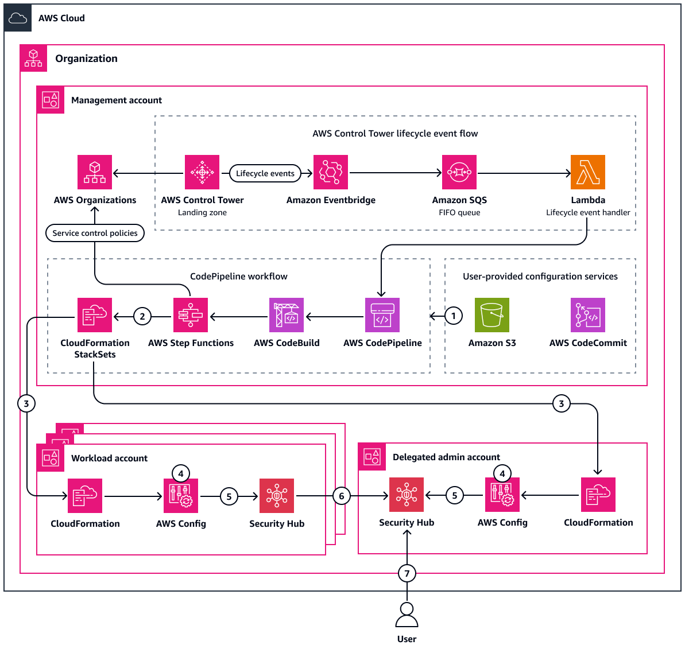

## Detect Amazon RDS instances with expiring CA certificates

As a security best practice, it is recommended that you encrypt data in transit between application servers and relational databases. You can use SSL or TLS to encrypt a connection to a database (DB) instance or cluster. These protocols help provide confidentiality, integrity, and authenticity between an application and database. The database uses a server certificate, which is issued by a [certificate authority (CA)](https://docs.aws.amazon.com/AmazonRDS/latest/UserGuide/UsingWithRDS.SSL.html#UsingWithRDS.SSL.RegionCertificateAuthorities) and is used to perform server identity verification. SSL or TLS verifies the authenticity of the certificate by validating its digital signature and ensuring it is not expired.

In the AWS Management Console, [Amazon Relational Database Service (Amazon RDS)](https://docs.aws.amazon.com/AmazonRDS/latest/UserGuide/Welcome.html) and [Amazon Aurora](https://docs.aws.amazon.com/AmazonRDS/latest/AuroraUserGuide/CHAP_AuroraOverview.html) provide notifications about DB instances that require certificate updates. However, to check for these notifications, you must log into each AWS account and navigate to the service console in each AWS Region. This task becomes more complex if you need to assess certificate validity across many AWS accounts that are managed as an organization in [AWS Organizations](https://docs.aws.amazon.com/organizations/latest/userguide/orgs_introduction.html).

By provisioning the infrastructure as code (IaC) provided in this pattern, you can detect expiring CA certificates for all Amazon RDS and Aurora DB instances in your AWS account or AWS organization. The [AWS CloudFormation](https://docs.aws.amazon.com/AWSCloudFormation/latest/UserGuide/Welcome.html) template provisions an AWS Config rule, an AWS Lambda function, and the necessary permissions. You can deploy it into a single account as a [stack](https://docs.aws.amazon.com/AWSCloudFormation/latest/UserGuide/stacks.html), or you can deploy it across the entire AWS organization as a [stack set](https://docs.aws.amazon.com/AWSCloudFormation/latest/UserGuide/what-is-cfnstacksets.html).

The code in this repository helps you set up the following target architecture.

For prerequisites and instructions for using this AWS Prescriptive Guidance pattern, see Detect Amazon RDS and Aurora database instances that have expiring CA certificates.

## Security

See [CONTRIBUTING](CONTRIBUTING.md#security-issue-notifications) for more information.

## License

This library is licensed under the MIT-0 License. See the LICENSE file.

